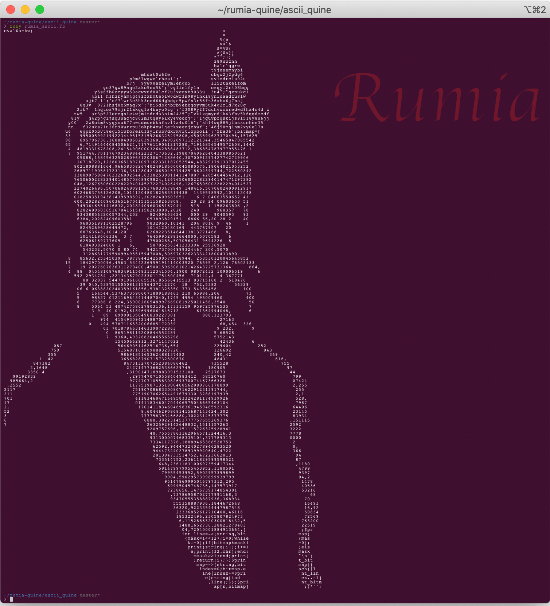

# rumia-quine
My simple quine programs : )

Including normal quines, Ouroboros quines and ASCII Art quines.

## ASCII Art Quine
I have implemented a simple ASCII art quine program. The ruby program `./ascii_quine/rumia_ascii.rb` is implemented using eval and lambda. It is **not just an ASCII Art but also a Quine program**, which means the output of this program is its own source code. You could run the script `./ascii_quine/check_output.sh` to verify.

Here is the screenshot:

## Normal Quine
I have implemented normal quine using different langages.

Normal Quines will print its own source code.

You could run the script `./normal_quine/check_output.sh` to verify.

### C quine
The C quine program `./normal_quine/printf.c` is implemented using printf. Classic implementation :)

### C++ quine
The C++ quine program `./normal_quine/str_replace.cpp` is implemented using std::string::replace.

### Ruby quine
1. `./normal_quine/eval.rb` is implemented using eval.
2. `./normal_quine/str_format.rb` is implemented using ruby string format.
3. `./normal_quine/heredoc.rb` is implemented using ruby heredoc.
4. `./normal_quine/base64.rb` is implemented using base64.
5. `./normal_quine/eval2.rb` is implemented using eval as well, which is from [ta-chibana's ASCII quine](https://github.com/ta-chibana/hey_quine).

## Ouroboros Quine
I have implemented Ouroboros quine using different langages as well.

Ouroboros Quines will print another source code written in different language, 
which will print another source code as well. 
Eventually, the original source code of first program will be printed.

### C -> Python -> C

The C and Python Ouroboros quine is under folder `./ouroboros_quine/c_python/`

The C program `quine.c` will output the python program `quine.py`,
while the python program `quine.py` will output the C program `quine.c`.
You could run the script `check_output.sh` to verify~

### Ruby -> Python -> Ruby

The Ruby and Python Ouroboros quine is under folder `./ouroboros_quine/ruby_python/`

The Ruby program `quine.rb` will output the python program `quine.py`,
while the Python program `quine.py` will output the Ruby program `quine.rb`.
You could run the script `check_output.sh` to verify~

